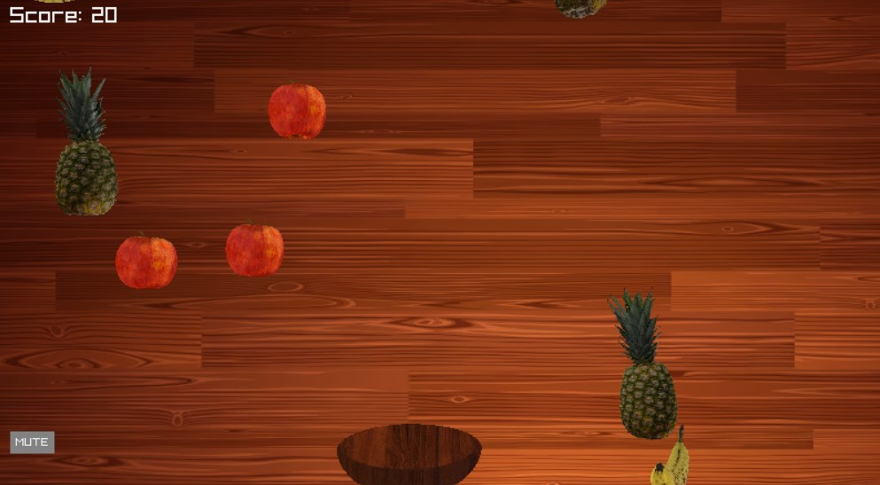

# About
This custom game is a continuation of my previous fruit collecting game. For this one, the rule is the same as the preivous version where you need to collect the fruits without letting them fall off the map. There are two version of the game, one being the normal difficulty and the other one is the "funny" (hard) difficulty. For the normal difficulty, the win condition is to score 200 points and for the funny difficulty, the win condition is to "survive". The background music for the normal mode is made by [pear8737](https://www.youtube.com/channel/UCuWfAq9BTpHx9Waz3R1RjNw) and [Nj0820](https://www.youtube.com/watch?v=kDZvuxlHFJA). The background music for the hard mode is made by [Casey Edwards](https://www.youtube.com/c/CaseyEdwards) and [Victor Borba](https://www.youtube.com/channel/UCgKUpNOPIIdOA0E_jeQaA-g). The only difference that this version of the game has that is different than the last verion is the addition of new fruits and completely new architecture.

An image of the gameplay.


## Description of Criterion
* DOECS was not violated
* There is interactble via the mouse control and keyboard control 
* The game does draw model and play sound
* There is multiple areas where text is displayed
* This is the description of criterion
* The window name is called AS9
* There is two systems (collision and spawn) that was not proposed in class
* The readme has pictures in it

## Extra Credit 
For the extra credit part, I attempted:
* Mouse Interaction
* Turn it in on time
* Predicate yourself (My predication is 95!)

# Set up
To run the code, first you need to git clone the CS-381 repository and then update submodules. Run the commands:
```bash
git init
git submodule add https://github.com/Xue-Shangqi/CS-381.git
git submodule init
git submodule update --init --recursive
```

# Build
After the submodules are updated, go into the CS-381 (if you are not already in it) and as9 folder and make a build folder:
```bash
cd CS-381
cd as9
mkdir build
cd build
```
After the folder is made, run cmake and make and finally run the code:
```bash
cmake ..
make
./as9
```
# Controls
There are basic movement controls in the game:
* A - Move left  
* D - Move right 